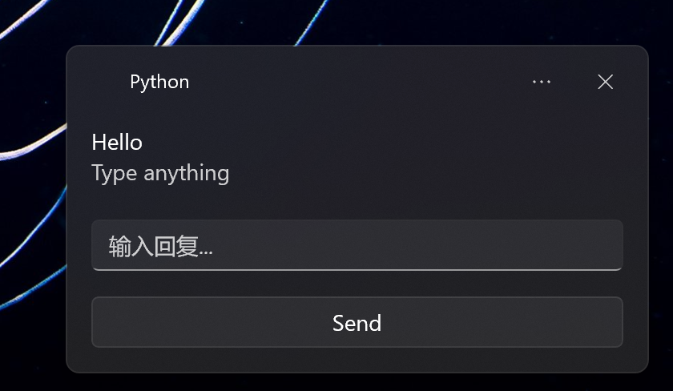

# windows11toast

Toast notifications for Windows 11 based on WinRT

A library for Windows 11 toast notifications based on WinRT



## Installation

### Recommended (using uv)

```bash
# Install uv (if not already installed)
# Windows PowerShell
powershell -ExecutionPolicy ByPass -c "irm https://astral.sh/uv/install.ps1 | iex"

# Initialize project (if pyproject.toml doesn't exist)
uv init

# Add dependency using uv
uv add windows11toast
```

### Using pip

```bash
pip install windows11toast
```

**Requirements:**
- Windows 11
- Python 3.9 - 3.13

## Features

- ✅ **Pythonic API** - Fully parameterized functions, no need to pass dictionaries
- ✅ **Type Hints** - Complete type hint support
- ✅ **StrEnum Support** - Use enums for better IDE autocomplete and type safety
- ✅ **Bilingual Documentation** - English and Chinese comments and documentation
- ✅ **Progress Notifications** - Support for real-time progress bar updates
- ✅ **Rich Notifications** - Support for images, icons, buttons, inputs, etc.
- ✅ **Built-in Resources** - Built-in Windows audio events and language options

## Basic Usage

### Simple Notification

```python
from windows11toast import toast

toast('Hello Python🐍')
```

### With Title and Body

```python
from windows11toast import toast

toast('Hello Python', 'Click to open url', on_click='https://www.python.org')
```

### Wrap Text

```python
from windows11toast import toast

toast('Hello', 'Lorem ipsum dolor sit amet, consectetur adipisicing elit...')
```

## Parameterized Image

### Using StrEnum (Recommended)

```python
from windows11toast import toast, ImagePlacement

# Hero image (large image)
toast(
    'Hello',
    'Hello from Python',
    image_src='https://example.com/image.jpg',
    image_placement=ImagePlacement.HERO
)

# Local file
toast(
    'Hello',
    'Hello from Python',
    image_src=r'C:\Users\YourName\Pictures\image.jpg',
    image_placement=ImagePlacement.HERO
)

# App logo override
toast(
    'Hello',
    'Hello from Python',
    image_src='https://example.com/logo.png',
    image_placement=ImagePlacement.APP_LOGO_OVERRIDE
)

# Inline image
toast(
    'Hello',
    'Hello from Python',
    image_src='https://example.com/image.jpg',
    image_placement=ImagePlacement.INLINE
)
```

## Parameterized Icon

**Note:** The `image_placement`, `icon_placement`, `icon_hint_crop`, and `duration` parameters **only support enum types**, not strings. Please use the corresponding enum classes (`ImagePlacement`, `IconPlacement`, `IconCrop`, `ToastDuration`).

## Parameterized Icon

### Using StrEnum (Recommended)

```python
from windows11toast import toast, IconPlacement, IconCrop

# Circular icon
toast(
    'Hello',
    'Hello from Python',
    icon_src='https://example.com/icon.png',
    icon_placement=IconPlacement.APP_LOGO_OVERRIDE,
    icon_hint_crop=IconCrop.CIRCLE
)

# Square icon
toast(
    'Hello',
    'Hello from Python',
    icon_src='https://example.com/icon.png',
    icon_placement=IconPlacement.APP_LOGO_OVERRIDE,
    icon_hint_crop=IconCrop.NONE
)
```

## Progress Notifications

### Create Progress Notification

```python
from time import sleep
from windows11toast import notify_progress, update_progress

# Parameterized API - more Pythonic
notify_progress(
    title='YouTube',
    status='Downloading...',
    value=0.0,
    value_string_override='0/15 videos'
)

# Update progress
for i in range(1, 16):
    sleep(1)
    update_progress(
        value=i/15,
        value_string_override=f'{i}/15 videos'
    )

# Update status
update_progress(status='Completed!')
```

### Multiple Concurrent Progress Notifications

```python
from windows11toast import notify_progress, update_progress

# Create multiple notifications with different tags
notify_progress(
    title='Video 1',
    status='Downloading...',
    value=0.0,
    tag='video1'
)

notify_progress(
    title='Video 2',
    status='Downloading...',
    value=0.0,
    tag='video2'
)

# Update each independently
update_progress(value=0.5, tag='video1')
update_progress(value=0.7, tag='video2')
```

## Audio

### Windows Built-in Audio Events (Using StrEnum)

```python
from windows11toast import toast, AudioEvent

# Using StrEnum - IDE autocomplete
toast('Hello', 'Hello from Python', audio=AudioEvent.LOOPING_ALARM)

# Default notification sound
toast('Hello', 'Hello from Python', audio=AudioEvent.DEFAULT)

# IM sound
toast('Hello', 'Hello from Python', audio=AudioEvent.IM)

# Mail sound
toast('Hello', 'Hello from Python', audio=AudioEvent.MAIL)

# Reminder sound
toast('Hello', 'Hello from Python', audio=AudioEvent.REMINDER)

# SMS sound
toast('Hello', 'Hello from Python', audio=AudioEvent.SMS)

# Looping alarms (1-10)
toast('Hello', 'Hello from Python', audio=AudioEvent.LOOPING_ALARM)
toast('Hello', 'Hello from Python', audio=AudioEvent.LOOPING_ALARM2)
# ... up to LOOPING_ALARM10

# Looping calls (1-10)
toast('Hello', 'Hello from Python', audio=AudioEvent.LOOPING_CALL)
# ... up to LOOPING_CALL10
```

### From URL

```python
from windows11toast import toast

toast('Hello', 'Hello from Python', audio='https://example.com/sound.mp3')
```

### From File

```python
from windows11toast import toast

toast('Hello', 'Hello from Python', audio=r'C:\Users\YourName\Music\sound.mp3')
```

### Silent

```python
from windows11toast import toast

toast('Hello Python🐍', audio=None)  # audio=None means silent
```

### Loop

```python
from windows11toast import toast, AudioEvent

toast(
    'Hello',
    'Hello from Python',
    audio=AudioEvent.LOOPING_ALARM,
    audio_loop=True  # Loop the audio
)
```

## Text-to-Speech

```python
from windows11toast import toast

toast('Hello Python🐍', dialogue='Hello world')
```

## OCR

### From URL

```python
from windows11toast import recognize

result = await recognize('https://example.com/image.png')
print(result.text)
```

### From File

```python
from windows11toast import recognize

result = await recognize(r'C:\Users\YourName\Pictures\image.png')
print(result.text)
```

### With Language (Using StrEnum)

```python
from windows11toast import recognize, OcrLanguage

# Using StrEnum
result = await recognize(
    r'C:\Users\YourName\Pictures\hello.png',
    lang=OcrLanguage.ZH_CN  # Chinese
)

result = await recognize(
    r'C:\Users\YourName\Pictures\hello.png',
    lang=OcrLanguage.JA  # Japanese
)

# Using string
result = await recognize(
    r'C:\Users\YourName\Pictures\hello.png',
    lang='en-US'  # English
)

# Auto-detect (use user profile language)
result = await recognize(
    r'C:\Users\YourName\Pictures\hello.png',
    lang=None  # or lang=OcrLanguage.AUTO
)
```

## Duration

### Using StrEnum (Recommended)

```python
from windows11toast import toast, ToastDuration

# Short duration (default)
toast('Hello Python🐍', duration=ToastDuration.SHORT)

# Long duration (25 seconds)
toast('Hello Python🐍', duration=ToastDuration.LONG)

# No timeout - Alarm scenario
toast('Hello Python🐍', duration=ToastDuration.ALARM)

# No timeout - Reminder scenario
toast('Hello Python🐍', duration=ToastDuration.REMINDER)

# No timeout - Incoming call scenario
toast('Hello Python🐍', duration=ToastDuration.INCOMING_CALL)

# No timeout - Urgent scenario
toast('Hello Python🐍', duration=ToastDuration.URGENT)
```

## Buttons

### Single Button

```python
from windows11toast import toast

toast('Hello', 'Hello from Python', button_content='Dismiss')
```

### Multiple Buttons

```python
from windows11toast import toast

toast('Hello', 'Click a button', buttons=['Approve', 'Dismiss', 'Other'])
```

## Input Fields

```python
from windows11toast import toast

result = toast(
    'Hello',
    'Type anything',
    input_id='reply',
    input_placeholder='Enter reply...',
    button_content='Send'
)
# result['user_input'] will contain {'reply': 'user typed text'}
```

## Selection

```python
from windows11toast import toast

result = toast(
    'Hello',
    'Which do you like?',
    selection_id='fruit',
    selections=['Apple', 'Banana', 'Grape'],
    button_content='Submit'
)
# result['user_input'] will contain {'fruit': 'selected option'}
```

## Callback

```python
from windows11toast import toast

def handle_click(result):
    print('Clicked!', result)
    print('Arguments:', result['arguments'])
    print('User Input:', result['user_input'])

toast('Hello Python', 'Click to open url', on_click=handle_click)
```

## Async

### Async Function

```python
from windows11toast import toast_async

async def main():
    await toast_async('Hello Python', 'Click to open url', on_click='https://www.python.org')

# Run in async context
import asyncio
asyncio.run(main())
```

### Non-blocking

```python
from windows11toast import notify

notify('Hello Python', 'Click to open url', on_click='https://www.python.org')
```

## Custom XML

```python
from windows11toast import toast

xml = """
<toast launch="action=openThread&amp;threadId=92187">
    <visual>
        <binding template="ToastGeneric">
            <text hint-maxLines="1">Jill Bender</text>
            <text>Check out where we camped last weekend!</text>
            <image placement="appLogoOverride" hint-crop="circle" src="https://example.com/icon.png"/>
            <image placement="hero" src="https://example.com/image.jpg"/>
        </binding>
    </visual>
    <actions>
        <input id="textBox" type="text" placeHolderContent="reply"/>
        <action
          content="Send"
          hint-inputId="textBox"
          activationType="background"
          arguments="action=reply&amp;threadId=92187"/>
    </actions>
</toast>"""

toast(xml=xml)
```

## StrEnum Options Reference

### ImagePlacement

- `ImagePlacement.HERO` - Large image
- `ImagePlacement.APP_LOGO_OVERRIDE` - App logo override
- `ImagePlacement.INLINE` - Inline

### IconPlacement

- `IconPlacement.APP_LOGO_OVERRIDE` - App logo override
- `IconPlacement.APP_LOGO_OVERRIDE_AND_HERO` - App logo override and hero

### IconCrop

- `IconCrop.CIRCLE` - Circular
- `IconCrop.NONE` - Square

### AudioEvent

- `AudioEvent.DEFAULT` - Default notification sound
- `AudioEvent.IM` - IM sound
- `AudioEvent.MAIL` - Mail sound
- `AudioEvent.REMINDER` - Reminder sound
- `AudioEvent.SMS` - SMS sound
- `AudioEvent.LOOPING_ALARM` to `LOOPING_ALARM10` - Looping alarms (1-10)
- `AudioEvent.LOOPING_CALL` to `LOOPING_CALL10` - Looping calls (1-10)

### ToastDuration

- `ToastDuration.SHORT` - Short duration
- `ToastDuration.LONG` - Long duration (25 seconds)
- `ToastDuration.ALARM` - No timeout - Alarm
- `ToastDuration.REMINDER` - No timeout - Reminder
- `ToastDuration.INCOMING_CALL` - No timeout - Incoming call
- `ToastDuration.URGENT` - No timeout - Urgent

### OcrLanguage

- `OcrLanguage.AUTO` - Auto (use user profile language)
- `OcrLanguage.EN_US` - English (US)
- `OcrLanguage.ZH_CN` - Chinese (Simplified)
- `OcrLanguage.JA` - Japanese
- `OcrLanguage.KO` - Korean
- `OcrLanguage.FR` - French
- `OcrLanguage.DE` - German
- `OcrLanguage.ES` - Spanish
- `OcrLanguage.IT` - Italian
- `OcrLanguage.PT` - Portuguese
- `OcrLanguage.RU` - Russian
- `OcrLanguage.AR` - Arabic
- `OcrLanguage.HI` - Hindi

## API Reference

### Main Functions

#### `toast(title, body, ...)`

Create and show a synchronous toast notification.

**Key Parameters:**
- `title`: Notification title
- `body`: Notification body
- `image_src`: Image source URL/path
- `image_placement`: Image placement (`ImagePlacement` enum or string)
- `icon_src`: Icon source URL/path
- `icon_placement`: Icon placement (`IconPlacement` enum or string)
- `icon_hint_crop`: Icon crop hint (`IconCrop` enum or string)
- `audio`: Audio source (`AudioEvent` enum, URL, or file path), `None` for silent
- `audio_loop`: Whether to loop the audio
- `duration`: Toast duration (`ToastDuration` enum or string)
- `on_click`: Callback function or URL string

#### `notify_progress(title, status, value, value_string_override, ...)`

Create a progress notification with parameterized API.

**Key Parameters:**
- `title`: Progress bar title
- `status`: Status text
- `value`: Progress value (0.0 to 1.0)
- `value_string_override`: Custom progress string
- `tag`: Notification tag for updates (default: `'my_tag'`)

#### `update_progress(value, status, value_string_override, tag, ...)`

Update a progress notification.

**Key Parameters:**
- `value`: Progress value (0.0 to 1.0)
- `status`: Status text to update
- `value_string_override`: Custom progress string
- `tag`: Notification tag (must match original)

#### `toast_async(...)`

Async version of `toast`.

#### `notify(...)`

Low-level notification function (non-blocking).

#### `clear_toast(app_id, tag, group)`

Clear notifications from history.

## Improvements

### What's New

1. **Fully Parameterized API**
   - Removed all dictionary support
   - Use StrEnum for better IDE support
   - Complete type hints for all functions

2. **Built-in Resources**
   - `AudioEvent` - Windows built-in audio event enums
   - `ToastDuration` - Toast duration enums (including no-timeout scenarios)
   - `OcrLanguage` - OCR language option enums
   - `ImagePlacement`, `IconPlacement`, `IconCrop` - Image and icon option enums

3. **Progress Notifications**
   - `notify_progress()` - Create progress notifications
   - `update_progress()` - Update progress
   - Support for multiple concurrent notifications

4. **Audio Improvements**
   - `audio=None` means silent (instead of `audio={'silent': 'true'}`)
   - `audio_loop` parameter for looping
   - Support for `AudioEvent` enum and strings

5. **OCR Improvements**
   - Parameterized `lang` parameter
   - Support for `OcrLanguage` enum

6. **Bug Fixes**
   - Fixed `user_input()` TypeError
   - Fixed notification update issues
   - Fixed default `on_click` printing unwanted output

7. **Documentation**
   - Bilingual comments (English/Chinese)
   - Complete type hints
   - Comprehensive examples

## Requirements

- Windows 11
- Python 3.9 - 3.13
- `winrt` package (installed automatically)

## License

MIT License

## Acknowledgements

This project is based on [win11toast](https://github.com/GitHub30/win11toast), thanks to the original author [GitHub30](https://github.com/GitHub30) for their open-source contribution.

This project has been refactored and improved upon the original:
- Fully parameterized API design
- Better type safety with StrEnum
- Complete type hint support
- Bilingual documentation (English/Chinese)
- Improved code structure

Other referenced projects:
- [winsdk_toast](https://github.com/...)
- [Windows-Toasts](https://github.com/...)
- [MarcAlx/notification.py](https://github.com/...)

## Related Links

- [Toast XML Schema](https://learn.microsoft.com/en-us/uwp/schemas/tiles/toastschema/element-toast)
- [Toast Progress Bar](https://learn.microsoft.com/en-us/windows/apps/design/shell/tiles-and-notifications/toast-progress-bar)
- [Notifications Visualizer](https://apps.microsoft.com/store/detail/notifications-visualizer/9NBLGGH5XSL1)

## Complete Examples

Complete examples for all features:

```python
from time import sleep

from windows11toast import (
    toast,
    notify,
    notify_progress,
    update_progress,
    ImagePlacement,
    IconPlacement,
    IconCrop,
    AudioEvent,
    ToastDuration,
    OcrLanguage,
    recognize,
    toast_async
)


# ============================================================================
# 1. Basic Notifications
# ============================================================================

def example_simple_notification():
    """Simple Notification"""
    toast('Hello Python🐍')


def example_notification_with_title_and_body():
    """With Title and Body"""
    toast('Hello Python', 'Click to open url', on_click='https://www.python.org')


def example_wrap_text():
    """Wrap Text"""
    toast('Hello', 'Lorem ipsum dolor sit amet, consectetur adipisicing elit...')


# ============================================================================
# 2. Image Notifications
# ============================================================================

def example_image_with_strenum():
    """Using StrEnum"""
    # Hero image (large image)
    toast(
        'Hello',
        'Hello from Python',
        image_src='https://example.com/image.jpg',
        image_placement=ImagePlacement.HERO
    )


def example_image_local_file():
    """Local File"""
    toast(
        'Hello',
        'Hello from Python',
        image_src=r'C:\Users\YourName\Pictures\image.jpg',
        image_placement=ImagePlacement.HERO
    )


def example_image_app_logo():
    """App Logo Override"""
    toast(
        'Hello',
        'Hello from Python',
        image_src='https://example.com/logo.png',
        image_placement=ImagePlacement.APP_LOGO_OVERRIDE
    )


def example_image_inline():
    """Inline Image"""
    toast(
        'Hello',
        'Hello from Python',
        image_src='https://example.com/image.jpg',
        image_placement=ImagePlacement.INLINE
    )


# ============================================================================
# 3. Icon Notifications
# ============================================================================

def example_icon_circular():
    """Circular Icon"""
    toast(
        'Hello',
        'Hello from Python',
        icon_src='https://example.com/icon.png',
        icon_placement=IconPlacement.APP_LOGO_OVERRIDE,
        icon_hint_crop=IconCrop.CIRCLE
    )


def example_icon_square():
    """Square Icon"""
    toast(
        'Hello',
        'Hello from Python',
        icon_src='https://example.com/icon.png',
        icon_placement=IconPlacement.APP_LOGO_OVERRIDE,
        icon_hint_crop=IconCrop.NONE
    )


# ============================================================================
# 4. Progress Notifications
# ============================================================================

def example_progress_notification():
    """Create Progress Notification"""
    # Create progress notification
    notify_progress(
        title='YouTube',
        status='Downloading...',
        value=0.0,
        value_string_override='0/15 videos'
    )

    # Update progress
    for i in range(1, 16):
        sleep(1)
        update_progress(
            value=i/15,
            value_string_override=f'{i}/15 videos'
        )

    # Update status
    update_progress(status='Completed!')


def example_multiple_progress_notifications():
    """Multiple Concurrent Progress Notifications"""
    # Create multiple notifications with different tags
    notify_progress(
        title='Video 1',
        status='Downloading...',
        value=0.0,
        tag='video1'
    )

    notify_progress(
        title='Video 2',
        status='Downloading...',
        value=0.0,
        tag='video2'
    )

    # Update each independently
    update_progress(value=0.5, tag='video1')
    update_progress(value=0.7, tag='video2')


def example_progress_with_icon():
    """Progress Notification with Icon"""
    notify_progress(
        title='Download',
        status='Downloading file...',
        value=0.0,
        icon_src='https://example.com/icon.png',
        icon_placement=IconPlacement.APP_LOGO_OVERRIDE,
        icon_hint_crop=IconCrop.CIRCLE,
        image_src='https://example.com/image.jpg',
        image_placement=ImagePlacement.HERO
    )


# ============================================================================
# 5. Audio Notifications
# ============================================================================

def example_audio_default():
    """Default Notification Sound"""
    notify('Hello', 'Hello from Python', audio=AudioEvent.DEFAULT)


def example_audio_im():
    """IM Sound"""
    notify('Hello', 'Hello from Python', audio=AudioEvent.IM)


def example_audio_mail():
    """Mail Sound"""
    notify('Hello', 'Hello from Python', audio=AudioEvent.MAIL)


def example_audio_reminder():
    """Reminder Sound"""
    notify('Hello', 'Hello from Python', audio=AudioEvent.REMINDER)


def example_audio_sms():
    """SMS Sound"""
    notify('Hello', 'Hello from Python', audio=AudioEvent.SMS)


def example_audio_looping_alarm():
    """Looping Alarm"""
    notify('Hello', 'Hello from Python', audio=AudioEvent.LOOPING_ALARM)


def example_audio_from_url():
    """Audio from URL"""
    toast('Hello', 'Hello from Python', audio='https://example.com/sound.mp3')


def example_audio_from_file():
    """Audio from File"""
    toast('Hello', 'Hello from Python', audio=r'C:\Users\YourName\Music\sound.mp3')


def example_audio_silent():
    """Silent Notification"""
    notify('Hello Python🐍', audio=None)  # audio=None means silent


def example_audio_loop():
    """Loop Audio"""
    notify(
        'Hello',
        'Hello from Python',
        audio=AudioEvent.LOOPING_ALARM,
        audio_loop=True  # Loop the audio
    )


# ============================================================================
# 6. Text-to-Speech
# ============================================================================

def example_text_to_speech():
    """Text-to-Speech"""
    toast('Hello Python🐍', dialogue='Hello world')


# ============================================================================
# 7. OCR
# ============================================================================

async def example_ocr_from_url():
    """OCR from URL"""
    result = await recognize('https://example.com/image.png')
    print(result.text)


async def example_ocr_from_file():
    """OCR from File"""
    result = await recognize(r'C:\Users\YourName\Pictures\image.png')
    print(result.text)


async def example_ocr_chinese():
    """Specify Language - Chinese"""
    result = await recognize(
        r'C:\Users\YourName\Pictures\hello.png',
        lang=OcrLanguage.ZH_CN  # Chinese
    )
    print(result.text)


async def example_ocr_japanese():
    """Specify Language - Japanese"""
    result = await recognize(
        r'C:\Users\YourName\Pictures\hello.png',
        lang=OcrLanguage.JA  # Japanese
    )
    print(result.text)


async def example_ocr_with_string():
    """Using String for Language"""
    result = await recognize(
        r'C:\Users\YourName\Pictures\hello.png',
        lang='en-US'  # English
    )
    print(result.text)


async def example_ocr_auto():
    """Auto-detect Language"""
    result = await recognize(
        r'C:\Users\YourName\Pictures\hello.png',
        lang=None  # or lang=OcrLanguage.AUTO
    )
    print(result.text)


# ============================================================================
# 8. Duration
# ============================================================================

def example_duration_short():
    """Short Duration (default)"""
    notify('Hello Python🐍', duration=ToastDuration.SHORT)


def example_duration_long():
    """Long Duration (25 seconds)"""
    notify('Hello Python🐍', duration=ToastDuration.LONG)


def example_duration_alarm():
    """No Timeout - Alarm Scenario"""
    notify('Hello Python🐍', duration=ToastDuration.ALARM)


def example_duration_reminder():
    """No Timeout - Reminder Scenario"""
    notify('Hello Python🐍', duration=ToastDuration.REMINDER)


def example_duration_incoming_call():
    """No Timeout - Incoming Call Scenario"""
    notify('Hello Python🐍', duration=ToastDuration.INCOMING_CALL)


def example_duration_urgent():
    """No Timeout - Urgent Scenario"""
    notify('Hello Python🐍', duration=ToastDuration.URGENT)


# ============================================================================
# 9. Buttons
# ============================================================================

def example_button_single():
    """Single Button"""
    notify('Hello', 'Hello from Python', button_content='Dismiss')


def example_button_multiple():
    """Multiple Buttons"""
    notify('Hello', 'Click a button', buttons=['Approve', 'Dismiss', 'Other'])


# ============================================================================
# 10. Input Fields
# ============================================================================

def example_input_field():
    """Input Field"""
    result = notify(
        'Hello',
        'Type anything',
        input_id='reply',
        input_placeholder='Enter reply...',
        button_content='Send'
    )
    # result['user_input'] will contain {'reply': 'user typed text'}
    print(f"User input: {result.get('user_input', {})}")


# ============================================================================
# 11. Selection
# ============================================================================

def example_selection():
    """Selection"""
    result = notify(
        'Hello',
        'Which do you like?',
        selection_id='fruit',
        selections=['Apple', 'Banana', 'Grape'],
        button_content='Submit'
    )
    # result['user_input'] will contain {'fruit': 'selected option'}
    print(f"User input: {result.get('user_input', {})}")


# ============================================================================
# 12. Callback
# ============================================================================

def example_callback():
    """Callback"""
    def handle_click(result):
        print('Clicked!', result)
        print('Arguments:', result['arguments'])
        print('User Input:', result['user_input'])

    toast('Hello Python', 'Click to open url', on_click=handle_click)


# ============================================================================
# 13. Async
# ============================================================================

async def example_async():
    """Async Function"""
    await toast_async('Hello Python', 'Click to open url', on_click='https://www.python.org')


def example_non_blocking():
    """Non-blocking"""
    notify('Hello Python', 'Click to open url', on_click='https://www.python.org')


# ============================================================================
# 14. Complete Example
# ============================================================================

def example_complete():
    """Complete Example"""
    # 1. Basic notification
    toast('Welcome', 'Welcome to windows11toast!')
    sleep(1)

    # 2. Notification with image
    toast(
        'Image Notification',
        'This is a notification with an image',
        image_src=r'C:\Users\YourName\Pictures\image.jpg',
        image_placement=ImagePlacement.HERO
    )
    sleep(1)

    # 3. Notification with icon and audio
    notify(
        'Notification',
        'Notification with icon and audio',
        icon_src='https://example.com/icon.png',
        icon_placement=IconPlacement.APP_LOGO_OVERRIDE,
        icon_hint_crop=IconCrop.CIRCLE,
        audio=AudioEvent.DEFAULT,
        duration=ToastDuration.LONG
    )
    sleep(1)

    # 4. Progress notification
    notify_progress(
        title='Download Task',
        status='Downloading...',
        value=0.0,
        value_string_override='0/100 MB',
        icon_src='https://example.com/download.png',
        icon_placement=IconPlacement.APP_LOGO_OVERRIDE,
        audio=None  # Silent
    )

    # Update progress
    for i in range(1, 101):
        sleep(0.1)
        update_progress(
            value=i/100,
            value_string_override=f'{i}/100 MB'
        )

    # Complete
    update_progress(
        value=1.0,
        status='Download completed!',
        value_string_override='100/100 MB'
    )
    sleep(1)

    # 5. Silent notification
    notify('Silent Notification', 'This is a silent notification', audio=None)
    sleep(1)

    # 6. Loop audio
    notify(
        'Loop Audio',
        'This notification audio will loop',
        audio=AudioEvent.LOOPING_ALARM,
        audio_loop=True
    )
    sleep(1)

    # 7. No timeout notification (incoming call scenario)
    notify(
        'Incoming Call',
        'This is a notification with no timeout',
        duration=ToastDuration.INCOMING_CALL
    )


# ============================================================================
# Main Function - Call All Examples
# ============================================================================

def main():
    """Run all examples"""
    print("=" * 60)
    print("windows11toast Examples")
    print("=" * 60)
    
    # Basic notifications
    print("\n1. Basic Notifications")
    example_simple_notification()
    sleep(1)
    example_notification_with_title_and_body()
    sleep(1)
    example_wrap_text()
    sleep(2)
    
    # Image notifications
    print("\n2. Image Notifications")
    example_image_with_strenum()
    sleep(1)
    example_image_local_file()
    sleep(1)
    example_image_app_logo()
    sleep(1)
    example_image_inline()
    sleep(2)
    
    # Icon notifications
    print("\n3. Icon Notifications")
    example_icon_circular()
    sleep(1)
    example_icon_square()
    sleep(2)
    
    # Progress notifications
    print("\n4. Progress Notifications")
    example_progress_notification()
    sleep(2)
    
    # Audio notifications
    print("\n5. Audio Notifications")
    example_audio_default()
    sleep(1)
    example_audio_silent()
    sleep(1)
    example_audio_loop()
    sleep(2)
    
    # Text-to-speech
    print("\n6. Text-to-Speech")
    example_text_to_speech()
    sleep(2)
    
    # Duration
    print("\n7. Duration")
    example_duration_short()
    sleep(1)
    example_duration_long()
    sleep(2)
    
    # Buttons
    print("\n8. Buttons")
    example_button_single()
    sleep(1)
    example_button_multiple()
    sleep(2)
    
    # Non-blocking
    print("\n9. Non-blocking")
    example_non_blocking()
    sleep(2)
    
    print("\n" + "=" * 60)
    print("All examples completed!")
    print("=" * 60)
    print("\nNote: Some examples require user interaction (input fields, selection, callbacks)")
    print("\nTo run complete example, call: example_complete()")


async def main_async():
    """Run async examples"""
    print("\nRunning async examples...")
    
    # OCR examples (require actual image files)
    # print("\n10. OCR Examples")
    # await example_ocr_auto()
    
    # Async notification example
    print("\n10. Async Notification")
    await example_async()
    sleep(2)
    
    print("\nAsync examples completed!")


if __name__ == '__main__':
    # Run sync examples
    main()
    
    # Run async examples (uncomment to run)
    # import asyncio
    # asyncio.run(main_async())
```
